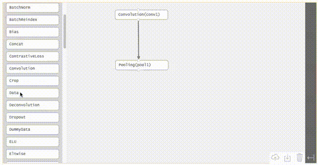

# dagstudio
Directed Acyclic Graph Studio with Javascript D3
Create nodes and links in a graph with an intuitive interface.

_Under development! The UI is working but no .prototxt import or export yet._

The intent is using this to create an interactive and intuitive dag creator for making graphs for ml frameworks.

